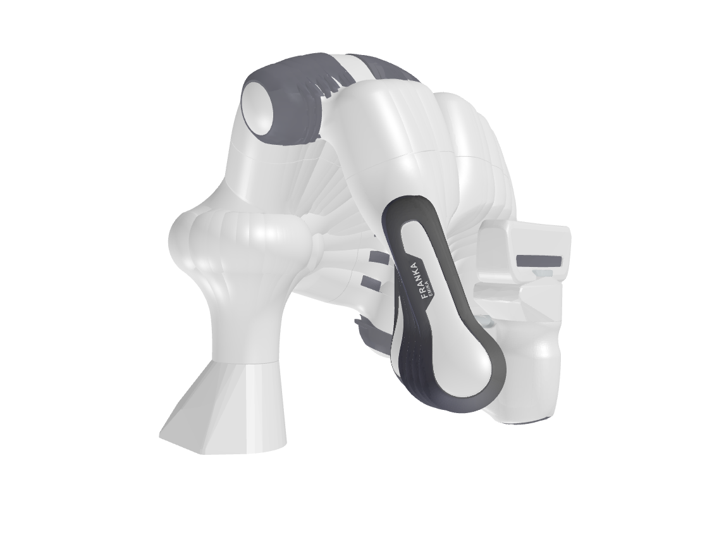

# TorchIK

A lightweight, PyTorch-based Inverse Kinematics solver designed for robotics research and applications.

## Key Features

- **Fast performance** with Gauss-Newton optimization
- **Parallel computation** for solving multiple IK problems simultaneously
- **Visualization capabilities** for debugging and demonstration
- **Simple structure** with minimal dependencies
- **Flexible architecture** adaptable to various robot configurations
- **End-to-end differentiability** supporting gradient-based learning

## Installation

```bash
pip install -r requirements.txt
```

## Quick Start

```bash
python ik_example.py
```

This runs a demonstration using the Franka robot model included in the repository. The result is like that:


## Using Your Own Robot

1. Create a `RobotModel` instance with your URDF file:

```python
robot = RobotModel(
    urdf_path='path/to/your/robot.urdf',
    last_link_name='end_effector',
    load_mesh=True,
    device='cpu'
)
```

2. Define target poses and run inverse kinematics:

```python
# Position and orientation (as quaternion) targets
targets = torch.tensor([[x, y, z, qw, qx, qy, qz]])

# Solve with multiple initial configurations for robustness
solutions = run_ik(robot, targets, n_samples=1000)
```

3. For visualization support, ensure your mesh files and link names align properly in the URDF.

## Implementation Notes

- Leverages PyTorch for GPU acceleration and automatic differentiation
- Quaternion-based orientation representation
- Supports batch processing for parallel computation
- Simple customization through the `RobotModel` class

